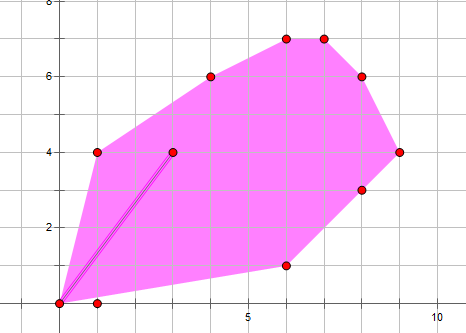
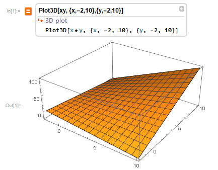

# [gym101982M][思维好题][凸壳]Mobilization

## 题目链接 
[20182019-acmicpc-pacific-northwest-regional-contest-div-1-en.pdf](https://codeforces.com/gym/101982/attachments/download/7897/20182019-acmicpc-pacific-northwest-regional-contest-div-1-en.pdf)

## 题目大意
现在有$n$种士兵，每种士兵有一个血量$h_i$和潜力$p_i$以及花销$c_i$。

你一共有$C$块钱，现在你要用这些钱去雇佣士兵，你雇佣某种士兵的数量可以是任意**实数**（也就是说并不一定要整数）。最后你构建出来军团的战斗力等于总血量与总潜力的乘积。

$(n\le3\times 10^4, 1\le C\le 10^5,1\le c_i \le 10^5, 0.0\le h_i,p_i\le 1.0)$

## 做法分析
为了简化问题，我们将每个人看作一个向量$\mathbf{v}$。
$$
\mathbf{v}_i = C
\begin{bmatrix}
\frac{h_i}{c_i} \\
\\
\frac{p_i}{c_i} \\
\end{bmatrix}
$$
这样构造是因为可以将组建军团的过程简化成一个向量集合的线性组合。

我们可以将最后组合出来的向量视作一个新的向量$\mathbf{u}$，其两维的乘积即为答案。


$$
\mathbf{u} = \sum_{i=1}^n x_i\mathbf{v}_i \\
需要满足\sum_{i=1}^n x_i \le 1 \\
求 \max\{\mathbf{u}_0 \times \mathbf{u}_1\}
$$

可以发现这样的形式正好描述了一个平面上一个点集(将每个向量$v_i$的终点看作一个点，起点为原点)，构成凸包，内部的点的贡献被覆盖。



我们的答案一定在凸壳上且最偏右上角，因为$f(x,y) = xy , x\ge0,y\ge0$(相当于两维相乘的值)的最值总是在凸型区域的右上角取到(马鞍形)。以下是无聊做的图...



由于答案总在右上角，我们只要维护上凸壳即可，问题解决，复杂度$O(N\log N)$

PS:代码是纯c，就是想尝试一下新东西，绘制了几个图片，好理解一点，这篇题解就是纯消磨时间的..。
``` c++
/*
gym101982m, 数学,优化，函数最值
*/
#include <stdio.h>
#include <stdlib.h>
#define max(a, b) (a) > (b) ? (a) : (b);
#define min(a, b) (a) < (b) ? (a) : (b);
#define N 30005
#define eps 1e-7
typedef long long LL;
struct point {
    double x, y;
};
inline struct point sub(struct point a, struct point b) {
    return (struct point){.x = a.x - b.x, .y = a.y - b.y};
}
inline double cross(struct point a, struct point b) {
    return a.x * b.y - a.y * b.x;
}
inline int sgn(double x) { return (x > eps) - (x < eps); }
int cmp(const void* a, const void* b) {
    struct point* p = (struct point*)a;
    struct point* q = (struct point*)b;
    if (!sgn(p->x - q->x)) {
        return sgn(p->y - q->y);
    } else
        return sgn(p->x - q->x);
}
double calc(struct point u, struct point v) {
    double A = (u.x - v.x) * (u.y - v.y);
    double B = (u.x - v.x) * v.y + (u.y - v.y) * v.x;
    double C = v.x * v.y;
    double x = -0.5 * B / A;
    if (sgn(x - 0.0) <= 0)
        return 0;
    else
        x = min(x, 1.0);
    return (A * x + B) * x + C;
}
int main() {
    struct point v[N], ch[N];
    double c[N], h[N], p[N], ans = 0.0;
    int n, C, m = 0;

    scanf("%d%d", &n, &C);
    for (int i = 0; i < n; i++) {
        scanf("%lf%lf%lf", &c[i], &h[i], &p[i]);
        v[i] = (struct point){.x = h[i] / c[i] * C, .y = p[i] / c[i] * C};
        ans = max(ans, v[i].x * v[i].y);
    }
    qsort(v, n, sizeof(v[0]), cmp);
    /*  for (int i = 0; i < n; i++) {
          printf("point %.3f %.3f\n", v[i].x, v[i].y);
      }*/
    for (int i = 0; i < n; i++) {
        while (m > 1 &&
               sgn(cross(sub(ch[m - 1], ch[m - 2]), sub(v[i], ch[m - 2]))) > 0)
            m--;
        ch[m++] = v[i];
    }
    /*  for (int i = 0; i < m; i++) {
          printf("convex hull %.3f %.3f\n", ch[i].x, ch[i].y);
      }*/
    for (int i = 0; i < m - 1; i++) {
        ans = max(ans, calc(ch[i], ch[i + 1]));
    }
    printf("%.2f\n", ans);
    return 0;
}
/*
4 100000
300 1 0.02
500 0.2 1
250 0.3 0.1
1000 1 0.1
*/
```
